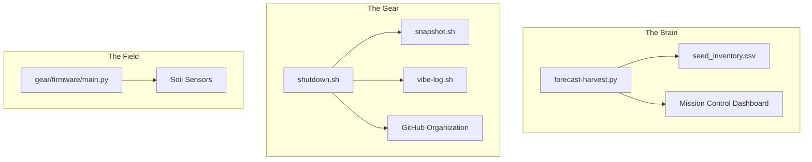

# 🏛️ FogSift Registry: Architecture Map
> Automated visual mapping of the local operational node.

```mermaid
graph TD
  subgraph Intelligence[The Brain]
    FH[forecast-harvest.py] --> SI[seed_inventory.csv]
    FH --> DB[Mission Control Dashboard]
  end
  subgraph Operations[The Gear]
    SH[shutdown.sh] --> SNAP[snapshot.sh]
    SH --> VL[vibe-log.sh]
    SH --> GH[GitHub Organization]
  end
  subgraph Physical[The Field]
    FW[gear/firmware/main.py] --> SN[Soil Sensors]
  end
```

--- 
*Generated: Wed Feb 25 14:53:12 PST 2026*
